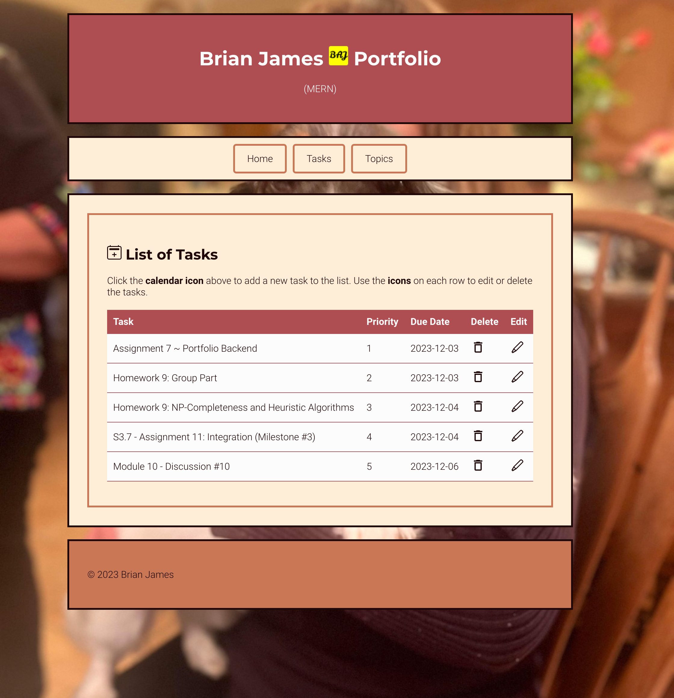

# Full-Stack Website (MERN)

A full-stack task tracking web application built primarily in **JavaScript** using the **MERN** stack (MongoDB, Express.js, React, Node.js).  
This project served as an exploration and hands-on learning experience in developing and structuring a modern web app using a RESTful API and component-based frontend.



## Features

- Task manager with **Create, Read, Update, Delete (CRUD)** functionality
- Multiple pages with a **navigation system**
- In-page **jump links** for smoother user experience
- Clean and responsive UI built with **React and CSS**
- Organized backend with **modular controllers and models**

## Tech Stack

**Languages**:
- JavaScript (ES6+)

**Frontend**:
- React.js
- HTML/CSS

**Backend**:
- Node.js
- Express.js
- MongoDB (NoSQL database)


## How to Run Locally

1. **Clone the repo**:
   ```bash
   git clone https://github.com/brianjames-dev/mern-task-app.git
   cd mern-task-app
   ```

2. **Install dependencies**:

   - Backend: (needs MongoDB code for database functionality)
     ```bash
     cd backend
     npm install
     ```

   - Frontend:
     ```bash
     cd ../frontend
     npm install
     ```

3. **Start the app**:

   - Backend:
     ```bash
     node tasks-controller.mjs
     ```

   - Frontend:
     ```bash
     npm start
     ```

4. Open your browser at:  
   [http://localhost:3000](http://localhost:3000)


## Learning Goals

- Practiced building a MERN architecture from scratch
- Gained familiarity with API routing, state management, and modular React design
- Experimented with UI navigation and user interaction patterns


## Folder Structure

```
frontend/    --> React app
backend/     --> Express server + MongoDB logic
```


## Author

**Brian James**  

📧 [brianjames.dev@gmail.com](mailto:brianjames.dev@gmail.com)  
🔗 [LinkedIn](https://www.linkedin.com/in/brianjames-dev/)  
🎸 [Instagram](https://www.instagram.com/brianallenjames)
